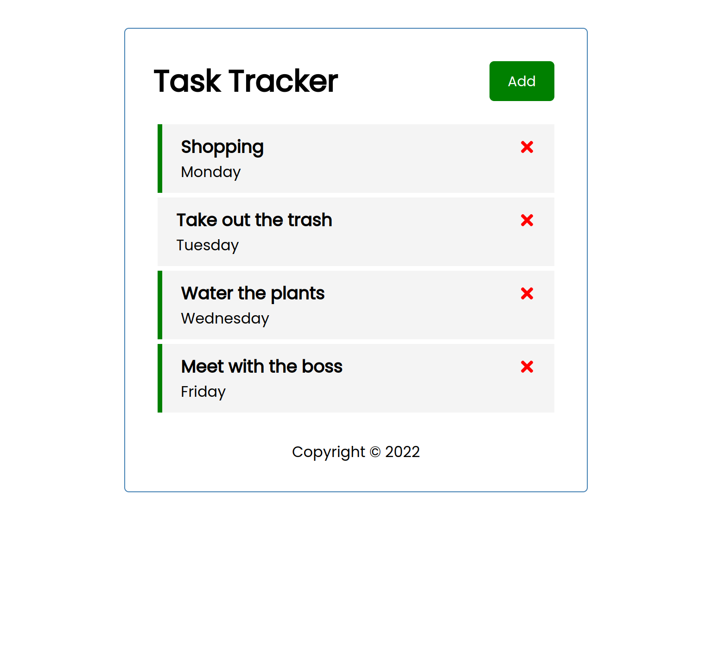
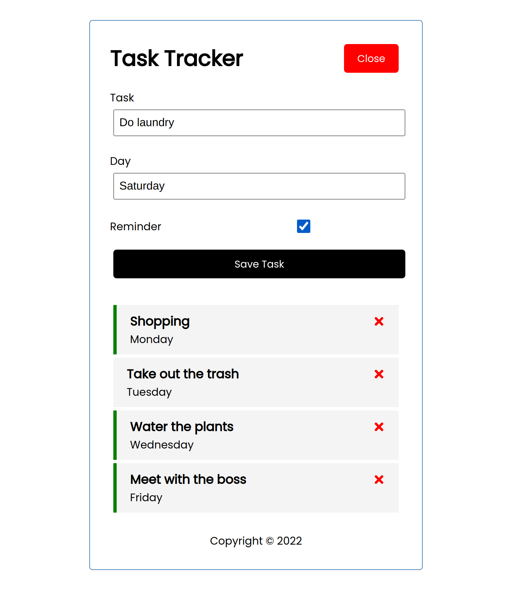

# Task Tracker made with React and json-server
This is a simple task tracker app made with React and json-server. It is a part of the React crash course by Traversy Media.

## Features
* User can add a task
* User can delete a task
* User can toggle reminder
* Using json-server to mock a backend
## Download & Setup Instructions

* 1 - Clone project:

      git clone https://github.com/bilal-zafarr/task-tracker.git
        
* 2 - Go to project directory:

      cd ./task-tracker

* 3 - Install dependencies: 
        
      npm install
        
* 4 - Run json-server: 
        
      npm run server
        
* 5 - Run project: 

      npm start
        
* 6 - Open project in browser:

      http://localhost:3000

## Screenshots
#### Home Page

#### Add Task

